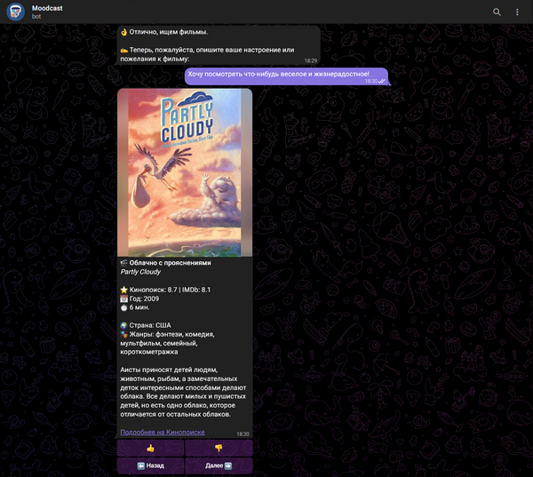

<h1 align="center">Moodcast</h1>

<p align="center">
  Telegram bot for movie and TV show recommendations based on user mood and plot themes
</p>

<p align="center">
  <a href="LICENSE">
    
  </a>
  
  
  
  
  
</p>

<p align="center">
  
</p>

<p align="center">
  <sub>Recommendation card with poster, ratings, navigation buttons and watchlist toggle</sub>
</p>

## About

Moodcast is an asynchronous Telegram bot that suggests films and TV series based on free-form mood descriptions and plot keywords.

The bot combines zero-shot emotion classification via Hugging Face Transformers, an intent parser for genre and theme extraction, and Kinopoisk API integration with multi-factor catalog scoring. A local SQLite database stores user bookmarks.

## Features

* Free-text mood analysis using the `MoritzLaurer/mDeBERTa-v3-base-mnli-xnli` model across 15 emotion categories
* Intent extraction for story themes (space, survival, superheroes, heists, zombies) and specific content types (documentaries, short films, 18+)
* Multi-factor scoring algorithm weighting Kinopoisk/IMDb ratings, genre relevance, country filters, and release dates
* Interactive Telegram cards with movie posters, synopsis, runtime, direct Kinopoisk links, and pagination
* Personal watchlist stored locally in SQLite with one-click toggles (`/watchlist`)
* Quick random hit mode for top-rated recommendations without text input (`/random`)
* Key rotation and automatic failover across multiple Kinopoisk API keys with rate-limit protection

## Project Structure

```text
moodcast/
├── main.py                  # Bot entry point and lifecycle management
├── moodcast_core/           # Core library
│   ├── config.py            # Configuration, genre mapping, scoring weights
│   ├── database.py          # SQLite persistence for user bookmarks
│   ├── handlers.py          # Telegram command and callback handlers
│   ├── intent.py            # Intent extraction and keyword parsing
│   ├── kinopoisk.py         # Async Kinopoisk API client and ranking engine
│   ├── models.py            # Dataclasses and enum definitions
│   ├── nlp.py               # Hugging Face zero-shot classification pipeline
│   └── utils.py             # Formatting and HTML helpers
├── docs/screenshots/        # Documentation assets
├── requirements.txt         # Project dependencies
├── .env.example             # Template for required environment variables
├── .gitignore
├── LICENSE
└── README.md
```

## Requirements

* Python 3.10 or newer
* A Telegram bot token from [@BotFather](https://t.me/BotFather)
* At least one API key from [kinopoiskapiunofficial.tech](https://kinopoiskapiunofficial.tech/)

## Setup and Running

### 1. Clone the repository

```bash
git clone https://github.com/DamianEhrenburg/moodcast.git
cd moodcast
```

### 2. Set up virtual environment

```bash
python -m venv venv

# Windows:
venv\Scripts\activate

# Linux / macOS:
source venv/bin/activate
```

### 3. Install dependencies

```bash
pip install -r requirements.txt
```

### 4. Configure environment variables

Create a `.env` file based on `.env.example`:

```bash
cp .env.example .env
```

Set your bot token and API keys in `.env`:

```env
TELEGRAM_BOT_TOKEN=your_telegram_bot_token_here
KINOPOISK_API_KEY=your_primary_key_here,your_secondary_key_here
```

Multiple Kinopoisk API keys can be specified as a comma-separated list to support automatic rotation when daily quotas are reached.

### 5. Start the bot

```bash
python main.py
```

## Privacy and Storage

* User bookmarks are stored locally in an SQLite database (`moodcast.db`).
* The bot does not transmit user data or viewing history to external services, other than necessary search requests to Kinopoisk and Telegram APIs.
* Text emotion classification is performed locally on the machine via PyTorch.

## Русский

<details>
<summary>Описание на русском языке</summary>

Moodcast — асинхронный Telegram-бот для подбора фильмов и сериалов по описанию настроения и тематическим запросам в свободной форме.

Бот объединяет Zero-Shot классификацию эмоций через Hugging Face Transformers (`mDeBERTa-v3`), парсер интентов для извлечения сюжетов и жанров, а также клиент Kinopoisk API с многофакторным скорингом каталога.

### Возможности

* определение 15 категорий эмоций по свободному тексту с помощью модели `MoritzLaurer/mDeBERTa-v3-base-mnli-xnli`;
* извлечение тем сюжета (космос, выживание, супергерои, ограбления, зомби) и спецкатегорий (документальное кино, короткометражки, 18+);
* многофакторный скоринг с учетом рейтингов Кинопоиска и IMDb, релевантности жанров и года выпуска;
* карточки с постерами, описаниями, ссылками на Кинопоиск и кнопками навигации;
* персональный список закладок в локальной SQLite базе данных (`/watchlist`);
* режим быстрой выдачи случайного высоко оцененного фильма (`/random`);
* поддержка ротации нескольких API-ключей Кинопоиска при исчерпании суточного лимита.

### Требования

* Python 3.10 или новее;
* токен бота от [@BotFather](https://t.me/BotFather);
* API-ключ от [kinopoiskapiunofficial.tech](https://kinopoiskapiunofficial.tech/).

### Установка и запуск

```bash
git clone https://github.com/DamianEhrenburg/moodcast.git
cd moodcast
python -m venv venv
venv\Scripts\activate
pip install -r requirements.txt
```

Создайте файл `.env` на основе `.env.example`:

```env
TELEGRAM_BOT_TOKEN=ваш_токен_бота
KINOPOISK_API_KEY=первый_ключ,второй_ключ
```

Запуск бота:

```bash
python main.py
```

</details>

## License

Moodcast is distributed under the [MIT License](LICENSE).

<p align="center">
  <sub>
    Damian Ehrenburg ·
    <a href="https://github.com/DamianEhrenburg">GitHub</a>
  </sub>
</p>
